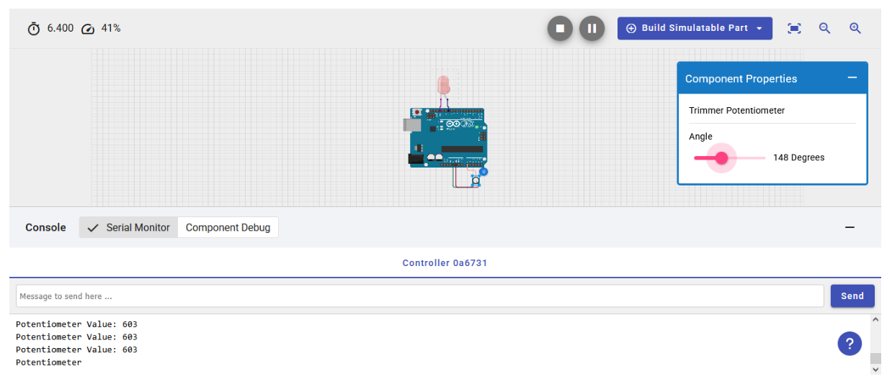

# Lab Experiment 01 — Arduino UNO with Potentiometer and LED

## Student Information

| Field | Details |
|---|---|
| **Name** | Ridwan Hasan Khandakar |
| **ID** | 2310604 |
| **Section** | 03 |
| **Course Code & Title** | CSE216L — Microprocessor, Interfacing, and Assembly Language Lab |
| **Course Instructor** | Noor-E-Sadman |
| **Experiment No** | 01 |
| **Experiment Title** | Arduino UNO with Potentiometer and LED |

---

## Objective

Control the brightness of an LED using a potentiometer connected to an Arduino UNO, and display the potentiometer readings on the Serial Monitor.

---

## Circuit Diagram



---

## Experiment Code

```cpp
/*
  This Arduino sketch controls the brightness of an LED using a potentiometer.
  The potentiometer is connected to analog pin A0, and the LED is connected to
  digital pin D11. The brightness of the LED is adjusted based on the analog
  input from the potentiometer. The analog value is also printed to the serial
  monitor for observation.
*/

const int ledPin = 11; // Pin connected to the LED
const int potPin = A0; // Pin connected to the potentiometer

void setup() {
  pinMode(ledPin, OUTPUT); // Set the LED pin as an output
  Serial.begin(9600);      // Start serial communication at 9600 baud
}

void loop() {
  int potValue = analogRead(potPin);                   // Read the potentiometer value
  int ledBrightness = map(potValue, 0, 1023, 0, 255);  // Map to 0-255 range
  analogWrite(ledPin, ledBrightness);                  // Set the LED brightness

  Serial.print("Potentiometer Value: ");
  Serial.println(potValue); // Print the potentiometer value

  delay(100); // Small delay for stability
}
```

---

## Summary

In this experiment, an Arduino Uno, a potentiometer, and an LED were used to control the brightness of the LED and display the readings on the serial monitor. The potentiometer was connected to an analog pin, while the LED was connected to a digital pin. Adjusting the potentiometer changes the LED's brightness accordingly.
