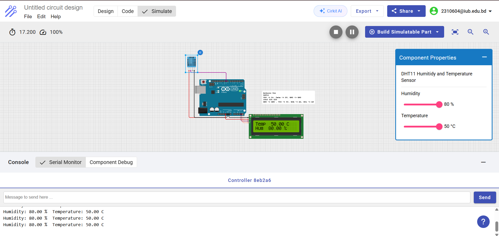

# Lab Experiment 02 — Simulating ADC for Humidity Sensor with LCD Display

## Student Information

| Field | Details |
|---|---|
| **Name** | Ridwan Hasan Khandakar |
| **ID** | 2310604 |
| **Section** | 03 |
| **Course Code & Title** | CSE216L — Microprocessor, Interfacing, and Assembly Language Lab |
| **Course Instructor** | Noor-E-Sadman |
| **Experiment No** | 02 |
| **Experiment Title** | Simulating ADC for Humidity Sensor and Displaying it on an LCD Display |

---

## Objective

Design and simulate an ADC interface for a DHT11 humidity and temperature sensor, and display the sensor readings on a 16x2 I2C LCD as well as the Serial Monitor.

---

## Circuit Diagram



---

## Components Used

- Arduino UNO
- DHT11 Temperature & Humidity Sensor (connected to Digital Pin D9)
- 16x2 I2C LCD Display (SDA → A4, SCL → A5)

---

## Libraries Required

- `Wire.h`
- `LiquidCrystal_I2C.h`
- `DHT.h`

---

## Experiment Code

```cpp
/*
  Reads temperature and humidity from DHT11
  Displays values on 16x2 I2C LCD
  Prints values to Serial Monitor
*/

#include <Wire.h>
#include <LiquidCrystal_I2C.h>
#include <DHT.h>

// -------- DHT11 Setup --------
#define DHTPIN 9       // Data pin connected to D9
#define DHTTYPE DHT11

DHT dht(DHTPIN, DHTTYPE);

// -------- LCD Setup --------
// Change 0x27 to 0x3F if your LCD doesn't display anything
LiquidCrystal_I2C lcd(0x27, 16, 2);

void setup() {
  Serial.begin(9600);

  // Initialize LCD
  lcd.begin(16, 2);
  lcd.backlight();

  // Initialize DHT sensor
  dht.begin();

  // Welcome message
  lcd.setCursor(0, 0);
  lcd.print("DHT11 Sensor");
  lcd.setCursor(0, 1);
  lcd.print("Initializing...");
  delay(2000);
  lcd.clear();
}

void loop() {
  float humidity    = dht.readHumidity();
  float temperature = dht.readTemperature();

  // Check if reading failed
  if (isnan(humidity) || isnan(temperature)) {
    Serial.println("Failed to read from DHT sensor!");
    lcd.clear();
    lcd.setCursor(0, 0);
    lcd.print("Sensor Error");
    delay(2000);
    return;
  }

  // ---- Serial Output ----
  Serial.print("Humidity: ");
  Serial.print(humidity);
  Serial.print(" % ");
  Serial.print("Temperature: ");
  Serial.print(temperature);
  Serial.println(" C");

  // ---- LCD Output ----
  lcd.clear();
  lcd.setCursor(0, 0);
  lcd.print("Temp: ");
  lcd.print(temperature);
  lcd.print(" C");
  lcd.setCursor(0, 1);
  lcd.print("Hum: ");
  lcd.print(humidity);
  lcd.print(" %");

  delay(2000); // Wait 2 seconds
}
```

---

## Summary

In this experiment, an ADC interface for a DHT11 humidity and temperature sensor was designed and simulated. The DHT11 sensor measures both temperature and humidity. The Arduino reads this data and displays it on the LCD screen while also printing it to the Serial Monitor. The DHT11 data pin is connected to Digital Pin 9, and the LCD is connected via I2C to SDA (A4) and SCL (A5).
