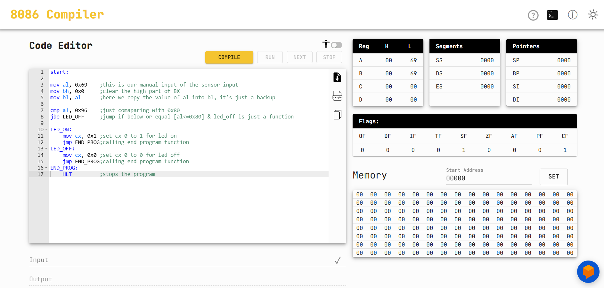

# Lab Experiment 05 — 8086 Microprocessor: Simulating Sensor Logic in an Emulator

## Student Information

| Field | Details |
|---|---|
| **Name** | Ridwan Hasan Khandakar |
| **ID** | 2310604 |
| **Section** | 03 |
| **Course Code & Title** | CSE216L — Microprocessor, Interfacing, and Assembly Language Lab |
| **Course Instructor** | Noor-E-Sadman |
| **Experiment No** | 05 |
| **Experiment Title** | 8086 Microprocessor: Simulating Sensor Logic in an Emulator |

---

## Objective

Simulate sensor-based LED control logic in an 8086 emulator using assembly language. The program reads a manual sensor input value and turns an LED on or off depending on whether the value exceeds a defined threshold.

---

## Tools Used

- 8086 Emulator (e.g., emu8086 or similar)
- Assembly Language (x86)

---

##Compiler



## Experiment Code

```asm
start:
    mov al, 0x69    ; Manual sensor input value
    mov bh, 0x0     ; Clear the high part of BX
    mov bl, al      ; Backup AL value into BL

    cmp al, 0x96    ; Compare input with threshold (0x96)
    jbe LED_OFF     ; Jump if below or equal → turn LED OFF

LED_ON:
    mov cx, 0x1     ; Set CX = 1 → LED ON
    jmp END_PROG    ; Jump to end

LED_OFF:
    mov cx, 0x0     ; Set CX = 0 → LED OFF
    jmp END_PROG    ; Jump to end

END_PROG:
    HLT             ; Stop the program
```

---

## Logic Flow

```
Sensor Input (AL = 0x69)
        |
   Compare with 0x96
        |
  AL <= 0x96?
   /         \
 YES          NO
  |            |
LED OFF      LED ON
(CX = 0)    (CX = 1)
        |
       HLT
```

---

## Key Concepts

| Instruction | Description |
|---|---|
| `MOV AL, 0x69` | Loads the simulated sensor value into AL |
| `CMP AL, 0x96` | Compares AL against the threshold value |
| `JBE LED_OFF` | Jumps to LED_OFF if AL ≤ 0x96 (Jump if Below or Equal) |
| `MOV CX, 0x1` | Sets CX to 1 to simulate LED ON |
| `MOV CX, 0x0` | Sets CX to 0 to simulate LED OFF |
| `HLT` | Halts CPU execution |

---

## Conclusion

In this experiment, the sensor input was changed from `0x90` to `0x69`, and the comparison threshold was updated from `0x80` to `0x96`. Since `0x69 <= 0x96`, the `JBE` condition is met and the LED turns OFF (`CX = 0`). The experiment confirmed that the `CMP` and `JBE` instructions in the assembly program work correctly for conditional branching based on sensor input values.
